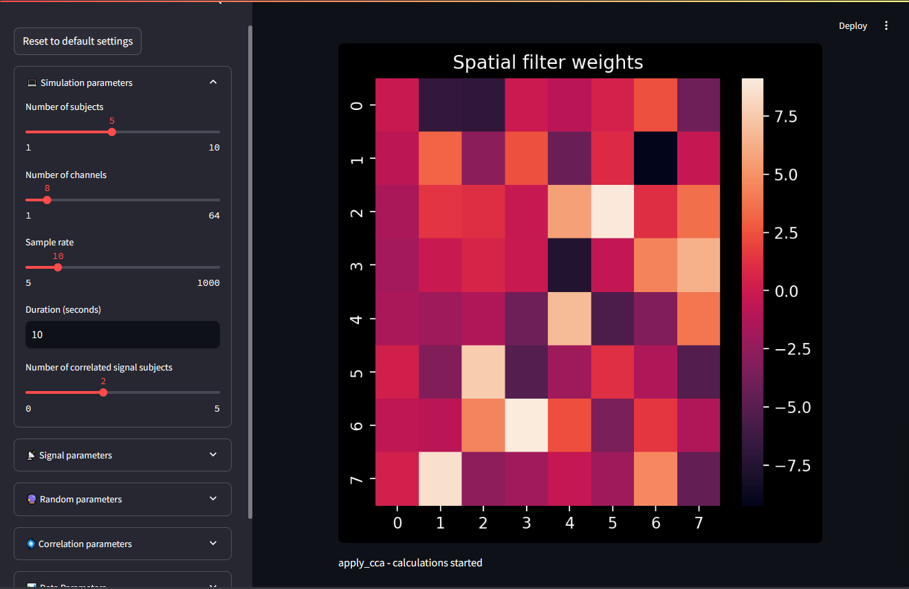

# isc-playground

An interactive [streamlit](https://streamlit.io/) app to play with Inter-Subject Correlation (ISC) analysis[^1].



## Installation

First, clone this repository:

```bash
git clone https://github.com/zeyus/isc-playground.git
cd isc-playground
```


### using uv

Make sure you have [uv](https://docs.astral.sh/uv/getting-started/installation/) installed.


Run the app:

```bash
uv run -- streamlit run isc-playground.py
```

### using docker compose

Make sure you have [docker-compose](https://docs.docker.com/compose/install/) installed.

Run the app:

```bash
docker-compose -f ./compose.yml up -d
```

Watch for changes, and rebuild the app if necessary:

```bash
docker-compose -f ./compose.yml watch
```

Stop the app:

```bash
docker-compose -f ./compose.yml down
```

## Usage

After you start the app (either with uv or docker-compose), you can visit your browser at `http://localhost:8501` to interact with the app.


[^1]: Dmochowski, J. P., Sajda, P., Dias, J., & Parra, L. C. (2012). Correlated Components of Ongoing EEG Point to Emotionally Laden Attention – A Possible Marker of Engagement? Frontiers in Human Neuroscience, 6. https://doi.org/10.3389/fnhum.2012.00112
